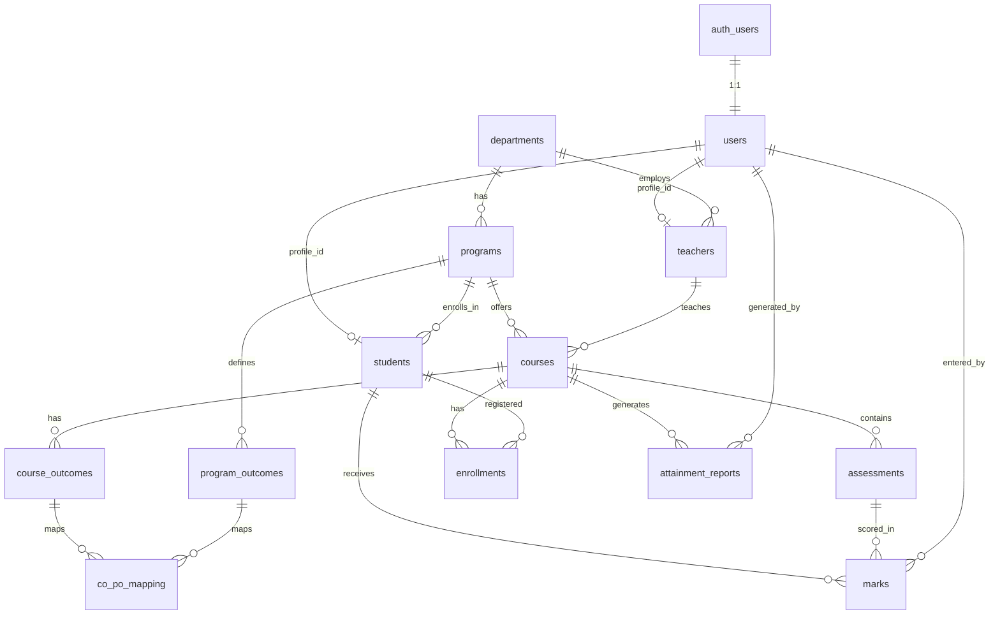

# Database Entity Relationships

## Table summary

| Table | Purpose |
|-------|---------|
| `users` | Auth-linked accounts (admin / teacher / student) |
| `teachers` | Faculty metadata (employee ID, department) |
| `students` | Student metadata (roll number, program, batch) |
| `courses` | Course catalog per semester |
| `course_outcomes` | CO definitions per course |
| `program_outcomes` | PO definitions per program |
| `co_po_mapping` | CO ↔ PO correlation (1–3) |
| `marks` | Scores per student per assessment |
| `attainment_reports` | Saved CO/PO attainment snapshots (JSONB) |
